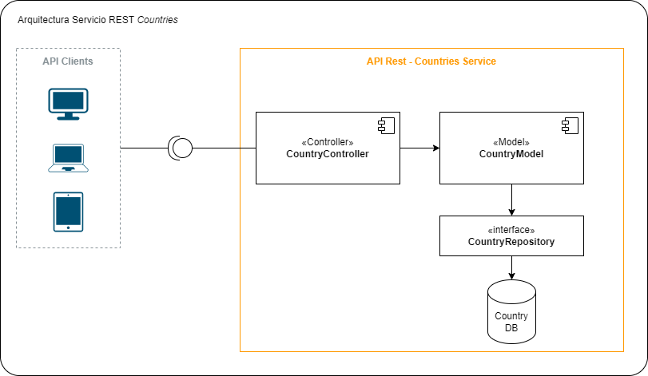

# Proyecto de Demostración Continuous Delivery
### Kyndryl Col

### Descripción
Este proyecto expone una API Rest que permite consultar datos de algunos paises.
Está diseñado para la ejecución de pipelines CI/CD en Github Action. 

### Pasos del Pipeline

- Testing
- Compilar aertefacto (.JAR)
- Compilar y Publicar Imagen Docker (como example)
- Desplegar en Appservice (Azure)

### Tecnologias

- Springboot 2.3
- JUnit 5
- Mockito
- JaCoCo 0.8.5
- Docker
- Github actions
- Azure Spring Apps

### Arquitectura
El proyecteo está construido sobre una arquitectura MVC (Model-View-Controller)

- Controller: Responsable de recibir las peticiones a traves de API Rest y trasladarla al modelo
- Model: Contiene la definición y mapeo de entidades con el repositorio de datos
- Repository: Interface que gestiona la comunicación con la Base de datos a través del patrón DAO 

---
    author: omar.noriega@kyndryl.com
    date: sep 12 2024

## Clean
    mvn clean

## Build
    mvn install
    
## Local deploy
    mvn spring-boot:run

### Status
Set Up App spring app.
